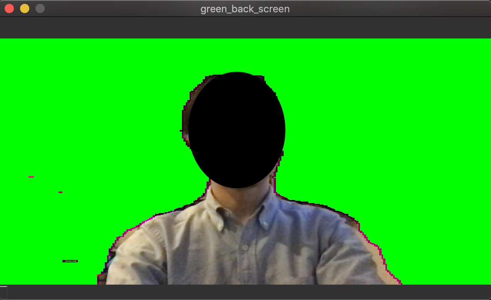

GREEN BACK CAMERA
===================

## Overview

You can get the greenback capture using your normal webcam.



## Requirement

* OS Windows, macOS or Linux
* Python 3.7
* Camera device.
* Only x86

## Setup


### Download trained model.

The software using DeepLabv3 model with tensorflow. You can download pre-trained model from google.
[See this site](https://www.tensorflow.org/lite/models/segmentation/overview)

```
$ wget https://storage.googleapis.com/download.tensorflow.org/models/tflite/gpu/deeplabv3_257_mv_gpu.tflite
```

### Install

```
$ git clone https://github.com/masato-ka/gb-cam.git
$ cd gb-cam
$ pip install .[platform]
$ cp <pre trained model path> .
```

* You can choose platform from windows, osx and linux

## Usage

```
$ cd gb-cam
$ gbcam
```

* Options

|option      |Description                  | Default                     |
|:-----------|-----------------------------|-----------------------------|
|-m(--model) |Path to the model path.      |deeplabv3_257_mv_gpu.tflite  |
|-c(--camera)|Camera device id.            | 0                           |
|-w(--width) |Camera device id.            | 640                         |
|-h(--height) |Camera device id.           | 420                         |
|-fps(--fps) |Camera device id.            | 30                         |


Camera startup and show window.

## Release

 * 2020/04/20 Alpha First Relase.

## Contribution

 If you find bug or some improvement ideas, please Fork and send pull request.

## Author

 * masato-ka(jp6uzv@gmail.com)

## License

 * MIT License

